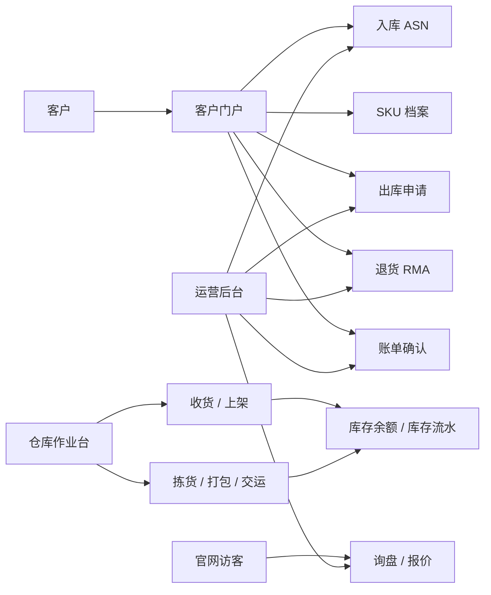

# Architecture

Open Warehouse System 是一个基于 Next.js App Router 的单体应用。当前目标不是追求复杂微服务，而是先把跨境仓储团队最常见的业务闭环放进一个可读、可部署、可迭代的代码库。

## High-level Flow

## Application Surfaces

- Marketing surface: `/`, `/services`, `/pricing`, `/inquiry`, `/help`
- Customer surface: `/login`, `/portal`, `/account`, `/inbound`, `/skus`, `/outbound`, `/returns`, `/billing`, `/tracking`
- Ops surface: `/ops-login`, `/ops`
- Warehouse surface: `/warehouse`, `/warehouse/print/*`
- API surface: `/api/*`

## Domain Modules

- `src/lib/customerAuth.ts` and `src/lib/staffAuth.ts`: customer and staff session helpers
- `src/lib/customerAccountStore.ts`: customer account and profile data
- `src/lib/warehouseCoreStore.ts`: SKU, inventory, outbound, returns, billing, carrier and warehouse operations
- `src/lib/documentStore.ts`: customer and ops document metadata
- `src/lib/notificationStore.ts`: customer and staff todo states
- `src/lib/auditLogStore.ts`: audit trail helpers
- `src/lib/db.ts`: PostgreSQL connection helper

## Persistence Strategy

The project currently supports two modes:

- Local fallback stores under `.local-data` for demos and lightweight development.
- PostgreSQL schema under `db/schema.sql` for production-oriented storage.

The roadmap is to keep the local fallback useful for onboarding while moving more core workflows to PostgreSQL-backed repositories.

## Security Boundaries

- Customer-facing pages and APIs should always scope data by `customer_code`.
- Staff-only APIs should require staff session validation.
- Production deployments must configure `SESSION_SECRET` and `STAFF_WHITELIST_JSON`.
- Demo login switches must stay disabled in production.
- Uploaded files need object storage, access control, and malware scanning before production use.
